This folder contains image files relating to the blog post entitled *Exploring Style*. The images come in two types: first, the original images fed to the neural network used to determine the style and, second, the images generated from these using only style and no content. In each case, the images are broken down into three further categories: photos, contrived, and art.

### Photos

These are details from photos that I took. The naming of the images was somewhat haphazard and I apologize if I mixed up my lichen and moss.

Original | Style   | Original | Style   | Original | Style    | Original | Style       
:-------:|:-------:|:--------:|:-------:|:--------:|:--------:|:--------:|:-------:
  |   |   |   |   |    |  | 
  |   |   |   | 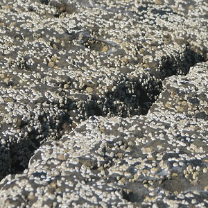  |   |   |   
  |   |   |   |   |   |   |  
  |   |   |   |   |  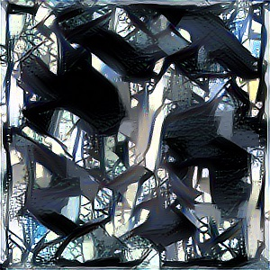 |   |  
  |   |   |   |   |   |   |  
  |   |   |   |   |   | 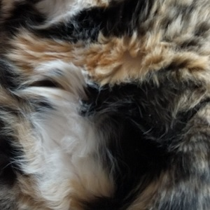  |  
  |   |   |   |   |   |   |  
  |   |   |   |   |   |   |  
  |   |   |   |   |  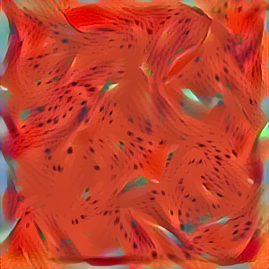 |   |  
  |   |   |   |   |   | 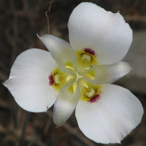  |  
  |   |   |   |   |   |   |  
  |   |   |   |   |   |   |  
  |   |   |   |   |   |   |  
  |   |   |  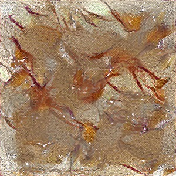 |   |   |   |  
  |   |   |   |   |   |   |  
  |   |   |   |   |   |   |  
  |   |   |   |   |  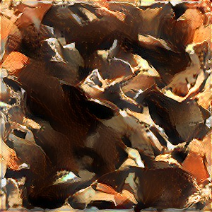 |   |  
  |   |   |  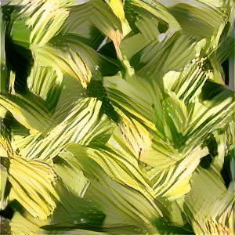 |   |   |   |  
  |   |   |   |   |   |   |  
  |   |   |   |   |   |   |  
  |  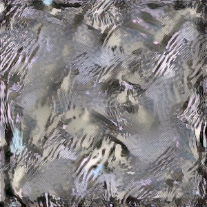 |   |   |   |   |   |  
  |   |   |   |   |  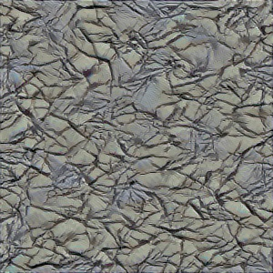 |   |  
  |   |   |   |   |   |   |  
  |   |   |   |   |   |   |  
  |   |   |   |   |   |   |  

### Contrived

These are simple images used to explore style transfer in a controlled way.

Original | Style   | Original | Style   | Original | Style    | Original | Style       
:-------:|:-------:|:--------:|:-------:|:--------:|:--------:|:--------:|:-------:
  |   |   |   |   |  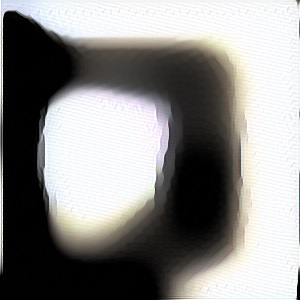  |  | 
  |   |   |   |   |   

### Art

I also played around with style transfer using famous artwork for the style images. These mostly didn't feature in the blog post, but I've added them here for yet another perspective on style. The base images were taken from Wikimedia Commons, cropped and downsized. These include: 

- The [first scene from the Bayeux Tapestry](https://commons.wikimedia.org/wiki/File:Bayeux_Tapestry_scene1_Edward.jpg)
- [*Portrait of Madame de Pompadour*](https://commons.wikimedia.org/wiki/File:Boucher_Marquise_de_Pompadour_1756.jpg) by François Boucher
- [*The Hunters in the Snow*](https://commons.wikimedia.org/wiki/File:Pieter_Bruegel_the_Elder_-_Hunters_in_the_Snow_(Winter)_-_Google_Art_Project.jpg) by Pieter Bruegel the Elder
- James Gillray's [*A voluptuary under the horrors of digestion*](https://commons.wikimedia.org/wiki/File:A-voluptuary.jpg) and [*The Plumb-pudding in danger*](https://commons.wikimedia.org/wiki/File:Caricature_gillray_plumpudding.jpg)
- A [detail from a Lekythos funerary vase](https://commons.wikimedia.org/wiki/File:Lekythos_funerary_vase_(detail)_depicting_Achilles_dragging_Hektor%E2%80%99s_body_by_chariot,_Delos,_sixth_century_BC.jpg)
- Ilya Repin's [*Reply of the Zaporozhian Cossacks*](https://commons.wikimedia.org/wiki/File:Ilja_Jefimowitsch_Repin_-_Reply_of_the_Zaporozhian_Cossacks_-_Yorck.jpg)
- [*Portrait of Anna of Austria*](https://commons.wikimedia.org/wiki/File:Anna_of_Austria_by_Rubens_(1622-1625,_Norton_Simon_Museum).jpg) and [*Saint Michael expelling Lucifer and the Rebellious Angels*](https://commons.wikimedia.org/wiki/File:Peter_Paul_Rubens_-_Saint_Michael_expelling_Lucifer_and_the_Rebellious_Angels,_1622.jpg) by Peter Paul Rubens
- [*A Storm on a Mediterranean Coast*](https://commons.wikimedia.org/wiki/File:Claude-Joseph_Vernet_-_A_Storm_on_a_Mediterranean_Coast_-_Google_Art_Project.jpg) by Claude-Joseph Vernet

Original | Style   | Original | Style   | Original | Style    | Original | Style       
:-------:|:-------:|:--------:|:-------:|:--------:|:--------:|:--------:|:-------:
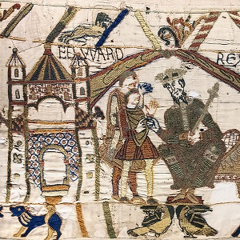  |   |   |   |   |  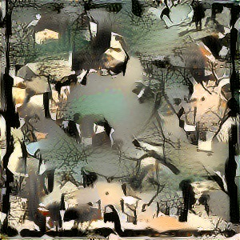  |  | 
  |   |   |   |   |    |  | 
  |   |   |  